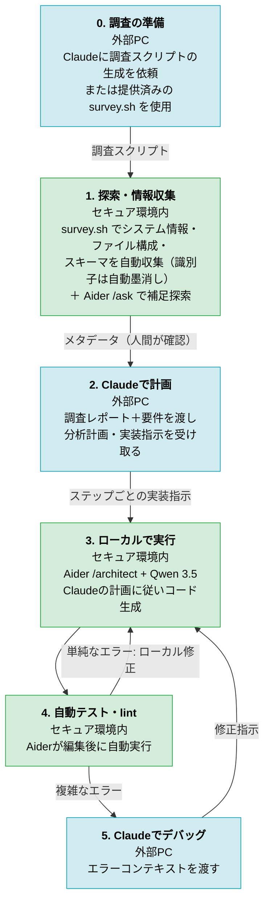
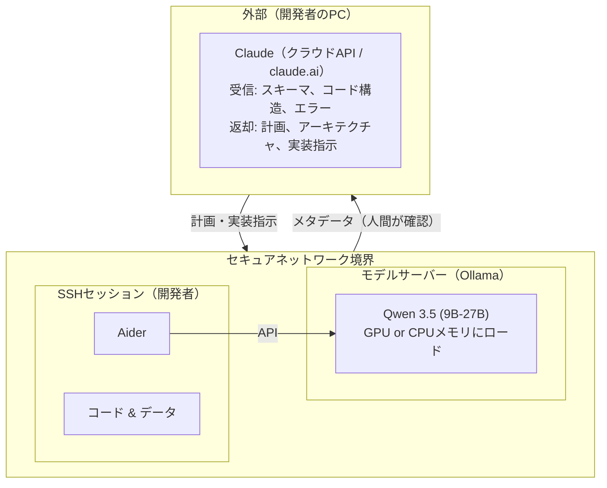
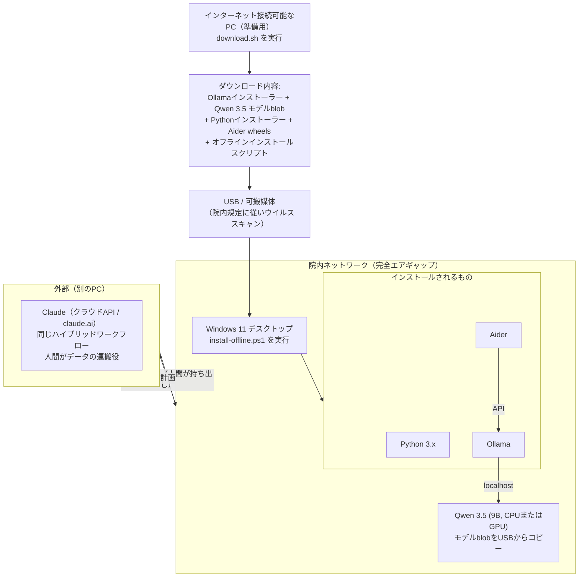

# 戦略: セキュアなゲノムデータ環境におけるAI支援コーディング

> **[English version (strategy.md)](strategy.md)**

## 1. 背景と目標

患者から提供された機密ゲノムデータを扱う**セキュア環境**で作業している。制約の異なる2つのデプロイシナリオがある:

**シナリオA — セキュアサーバー（SSH/VPN）**:
- インバウンド通信可: ソフトウェアパッケージのダウンロードは許可
- アウトバウンド通信禁止: データを外部ネットワークに送信することは不可
- アクセス方法: SSH/VPN経由のみ（CLIベースのワークフロー）
- sudo/管理者権限なし。GPUが利用できない場合あり

**シナリオB — エアギャップの院内環境（Windows 11）**:
- 全ネットワーク通信遮断（インバウンド・アウトバウンドともに禁止）
- ソフトウェアはUSB等の可搬媒体で持ち込み、院内規定に従いウイルススキャン後に利用
- 通常Windows 11デスクトップ。GPUの有無は環境による
- インストール時のみ管理者権限（PowerShell昇格）が利用可能な場合あり

いずれのシナリオでも、クラウドベースのAIコーディングアシスタント（Claude Code via Anthropic API、GitHub Copilotなど）を環境内のコードやデータに対して直接使用することはできない。

**目標**: ローカルAIコーディングエージェント（セキュア環境内で動作）とクラウドベースのClaude（設計・計画用に外部で使用）を組み合わせたハイブリッドワークフローを構築する。機密データがネットワーク外に出ることを防ぎつつ、設計・アーキテクチャの意思決定には最強のモデルを活用する。

**ローカルモデル候補**: Qwen 3.5（オープンウェイト、Apache 2.0ライセンス）

> **注**: Claude Codeがローカルモデルで動作するかを調査した結果、主要な手段としては非推奨と判断した。詳細は[付録A](#付録a-claude-codeとローカルモデルの調査結果)を参照。

---

## 2. 推奨戦略: ローカルファースト設計の専用ツール

Claude Codeにローカルモデルを無理やり使わせるのではなく、ローカル/エアギャップ運用と**モデル柔軟性を前提に設計された**ツールを使用する。

### 2.1 推奨ツールスタック

#### 主要ツール: Aider

- **リポジトリ**: https://github.com/paul-gauthier/aider
- **ライセンス**: Apache 2.0
- **選定理由**: 成熟した実績あるターミナルベースAIコーディングアシスタント。Ollama経由でQwen 3.5を含む任意のモデルに対応。Gitコミットの自動作成。コードベース全体のマッピング。活発なコミュニティ。
- **ローカルモデルサポート**: ファーストクラス。Ollama、llama.cpp、vLLM、LM Studioすべて対応。
- **エアギャップ対応**: モデルがローカルに読み込まれていればネットワーク通信不要。

#### 代替案: OpenCode

- **リポジトリ**: https://github.com/opencode-ai/opencode
- **ライセンス**: MIT
- **選定理由**: 規制産業向けに設計された**「エアギャップモード」**を明示的に搭載。LSPサポート付きネイティブターミナルUI。マルチセッション。75以上のLLMプロバイダーに対応。
- **ローカルモデルサポート**: Ollamaとのファーストクラス統合。
- **エアギャップ対応**: 明示的に設計されている。

#### 代替案: Goose CLI

- **選定理由**: 完全なローカル制御、オフラインファースト設計、永続セッション。クラウド依存なし。
- **エアギャップ対応**: 完全にローカルマシン上で動作。

### 2.2 モデル選定: Qwen 3.5

Qwen 3.5はこのユースケースに適した選択:

| 特性 | 値 |
|------|-----|
| **ライセンス** | Apache 2.0（商用利用可） |
| **アーキテクチャ** | 397Bパラメータ、トークンあたり17Bアクティブ（Mixture of Experts） |
| **コンテキスト長** | 262Kトークン（1Mまで拡張可能） |
| **コードベンチマーク** | SWE-bench Verified 72.4（27BモデルはGPT-5 miniと同等） |
| **ツール使用** | BFCL-V4 72.2（GPT-5 miniを30%上回る） |
| **利用可能サイズ** | 0.8B, 2B, 4B, 9B, 27B, 35B-A3B (MoE), 122B-A10B (MoE), 397B-A17B (MoE) |

**ハードウェア別の推奨サイズ**:

| ハードウェア | 推奨モデル | 量子化 |
|------------|-----------|--------|
| RTX 4090 1枚（24GB） | Qwen3.5-27B | Q4_K_M |
| RTX 6000 Ada（48GB）またはRTX 4090 2枚 | Qwen3.5-27B | Q8_0 / BF16 |
| A100 4枚（320GB）相当 | Qwen3.5-397B-A17B | FP16/BF16 |
| CPUのみ（128GB+ RAM） | Qwen3.5-9B | Q4_K_M |

**Qwen3-Coder-Next**も検討に値する — コーディングに特化したバリアントで、長期的推論とツール使用が強化されている。

### 2.3 モデルサービング: OllamaまたはvLLM

| | Ollama | vLLM |
|---|--------|------|
| **最適な用途** | シングルマシン、迅速なセットアップ | マルチGPUクラスター、高スループット |
| **セットアップの複雑さ** | 低（シングルバイナリ） | 中（Python、CUDA依存） |
| **Anthropic API互換** | あり（v0.14+） | あり（ネイティブサポート） |
| **量子化** | GGUF (Q4, Q5, Q8) | AWQ, GPTQ, FP16 |
| **マルチユーザー** | 限定的 | 対応済み |
| **エアギャップ対応** | あり — モデル事前ダウンロード | あり — モデル事前ダウンロード |

**推奨**: シンプルさを重視し**Ollama**から開始。マルチユーザーサービングや高スループットが必要になれば**vLLM**に移行。

---

## 3. ハイブリッドワークフロー: Claude（外部）+ ローカルエージェント（内部）

### 3.1 基本コンセプト

各モデルの得意領域を活用する:

- **Claude（クラウド）**: ハイレベルな計画、アルゴリズム設計、パイプラインアーキテクチャ — 最強の推論力が必要で、非機密のメタデータのみを入力とするタスク
- **ローカルエージェント + Qwen 3.5（セキュア環境内）**: コード探索、コード生成、実行、テスト — コードとデータへの直接アクセスが必要なタスク

人間のオペレーターが**データ境界のチェックポイント**として機能し、境界を越える情報を手動で確認する。

### 3.2 ワークフロー図



> **凡例**: 緑 = セキュア環境内、青 = 外部PC。ゲノムデータは絶対に境界を越えない。境界を越えるのはメタデータと計画のみ。

### 3.3 境界を越えてよい情報と越えてはならない情報

作業開始前に、オペレーターが外部に持ち出してよい情報の明確な分類を確立する:

| カテゴリ | 持ち出し可 | 絶対に持ち出し不可 |
|----------|-----------|-------------------|
| **ファイル構成** | ディレクトリツリー（`tree -L 2`）、ファイル形式と拡張子（VCF, BAM, FASTQ, CSV） | 研究・患者識別子を含むファイルパス |
| **データスキーマ** | 汎用的なカラム名・フィールド名（`chrom`, `pos`, `ref`, `alt`）、スキーマ定義、データ型情報 | 患者の疾患を示すカラム名 |
| **データ内容** | 行数・レコード数、ファイルサイズ | 実際の値 — 配列、バリアント、表現型（1行であっても不可） |
| **識別子** | 公開リファレンスゲノム識別子（例: GRCh38） | 患者識別子、患者に紐づくサンプルID |
| **コード** | スクリプト、パイプライン、設定ファイル（レビュー後\*） | ハードコードされた患者/研究ID、テストフィクスチャに埋め込まれたサンプルデータ、患者を参照するコメント |
| **ソフトウェア/設定** | ソフトウェアバージョン、ツール設定 | アクセス認証情報、APIキー、内部ホスト名 |
| **エラー出力** | エラーメッセージ（サニタイズ後） | データの断片や患者情報を含むエラーメッセージ |

\*コードを持ち出す前に以下を確認: 研究/患者IDを含むハードコードされたパス、テストフィクスチャに埋め込まれたサンプルデータ、患者を参照するコメント。

**原則**: 個々の患者から派生した、または紐づけ可能な情報は境界を越えてはならない。公開しても問題ないと確信が持てない情報は持ち出さない。

### 3.4 ワークフローにおける各モデルの役割

| ステップ | モデル | このモデルを使う理由 |
|---------|--------|---------------------|
| **0. 調査の準備** | クラウド Claude | Claudeがプロジェクト固有の調査スクリプトを生成、または提供済みの `survey.sh` を使用 |
| **1. 探索** | `survey.sh` ＋ 必要に応じてローカル Qwen 3.5（Aider `/ask`経由） | `survey.sh` がシステム情報、ファイル構成、スキーマ、ソフトウェア一覧を自動収集（識別子は自動墨消し）。Aider `/ask` でプロジェクト固有の補足探索 |
| **2. 計画** | クラウド Claude | アーキテクチャとアルゴリズム設計に最強の推論力。メタデータのみ参照 |
| **3. 実行** | ローカル Qwen 3.5（Aider `/architect` + `/code`経由） | 詳細な指示に従う。コードを書くためにファイルアクセスが必要 |
| **4. テスト** | モデル不要 | 自動lint、ユニットテスト、統合テスト |
| **5. デバッグ** | クラウド Claude | 複雑なデバッグには強力な推論が有効。エラーコンテキストは通常共有しても安全 |

**重要な知見**: ローカルモデルはClaudeほど高性能である必要はない。Claudeが詳細なステップごとの指示を提供するため、ローカルモデルの仕事は本質的に「詳細な仕様からのコード生成」であり、オープンエンドな設計よりもはるかに容易なタスクである。ステップ3にはQwen3.5-9Bでも十分な可能性がある。

### 3.5 ラウンドトリップの最適化

このワークフローの主なコストは、環境間の人的ラウンドトリップである。反復を最小化するために:

1. **`survey.sh`から始める**: `./survey.sh /path/to/project > report.txt` を実行し、システム情報、ファイル構成、スキーマ、ソフトウェア一覧を自動収集（識別子は自動墨消し）。プロジェクト固有の情報はAider `/ask` で補足するか、Claude（ステップ0）に調査スクリプトの生成を依頼
2. **Claudeに完全な計画を要求**: コードスニペット付きのステップごとの指示を要求し、曖昧なガイダンスは避ける
3. **Aiderの自動テストを活用**: lintとテストスイートを設定し、ラウンドトリップなしでエラーを検出
4. **変更をバッチ化**: 小さな変更ごとにラウンドトリップするのではなく、関連する変更を1つの計画にまとめる
5. **ローカルCLAUDE.mdを構築**: プロジェクトコンテキストをローカルの指示ファイルに蓄積し、将来のClaudeセッションが完全なコンテキストから開始できるようにする

---

## 4. デプロイアーキテクチャ

### 4.1 シナリオA — セキュアサーバー（SSH/VPN）



> インバウンド通信可 / アウトバウンド通信禁止。ゲノムデータはこの境界を絶対に越えない。

### 4.2 シナリオB — エアギャップの院内環境（USB転送）



> ネットワーク完全遮断（インバウンド・アウトバウンドともに禁止）。ゲノムデータはこの境界を絶対に越えない。

### 4.3 メンテナンスと更新

ツールチェーン（Ollama、Aider、Qwen 3.5）はバグ修正、セキュリティパッチ、モデル改善のために定期的な更新が必要になる。

**シナリオA**（インバウンドネットワーク利用可能）:

```bash
# Ollamaバイナリの更新
curl -fsSL "https://ollama.com/download/ollama-linux-amd64" -o ~/.local/bin/ollama

# モデルの更新（変更されたレイヤーのみダウンロード）
ollama pull qwen3.5:27b

# Aiderの更新
pip install --upgrade aider-chat    # または: pip install --user --upgrade aider-chat
```

**シナリオB**（エアギャップ — バンドルプロセスを再実行）:

1. インターネット接続可能なPCで、同じオプションを指定して `./download.sh` を再実行 — 最新バージョンがダウンロードされる
2. 新しいバンドルをUSBにコピーし、院内規定に従いウイルススキャン
3. 院内マシンで `install-offline.ps1`（または `.sh`）を再実行 — 以前のインストールが上書きされる

**バージョン固定**: 再現性を確保するため、セットアップ後にインストール済みバージョンを記録する:

```bash
ollama --version                    # Ollamaバージョン
ollama list                         # モデルタグとサイズ
pip show aider-chat | grep Version  # Aiderバージョン
python3 --version                   # Pythonバージョン
```

この出力をプロジェクト文書と一緒に保管しておけば、必要に応じて同一環境を再現できる。

---

## 5. 導入計画

2つのデプロイシナリオに対応。該当するパスを選択する:

- **シナリオA** — インバウンドネットワークアクセスのあるセキュアサーバー（SSH/VPN）。`install.sh`を使用。
- **シナリオB** — エアギャップの院内環境（ネットワークなし、Windows 11）。外部PCで`download.sh`を実行し、USBでバンドルを持ち込む。

### フェーズ1: インフラストラクチャ構築（第1-2週）

1. **セキュア環境内にマシンを確保**
   - GPU搭載: RTX 4090（24GB）でQwen3.5-27B Q4_K_M、RTX 6000 Ada（48GB）で27B Q8_0
   - GPUなし: CPUのみでQwen3.5-9B（低速だが動作可能）
   - 注: シナリオAではsudo/管理者権限は**不要**（install.shは`~/.local/bin`にインストール）
2. **ツールチェーンのインストール**

   **シナリオA**（セキュアサーバー、インバウンド通信可能）:
   ```bash
   # install.shはOllamaバイナリを~/.local/binにダウンロード（sudoなし）、
   # モデルをプルし、Aiderをpipでインストール:
   ./install.sh                    # GPU自動検出、デフォルト27Bモデル
   ./install.sh --model 9b --cpu   # CPUのみで小さなモデル
   ```

   **シナリオB**（エアギャップの院内環境、ネットワークなし）:
   ```bash
   # ステップ1: インターネット接続可能なPCですべてダウンロード:
   ./download.sh                          # デフォルト: Windows 11、9bモデル
   ./download.sh --model 27b             # GPUがあれば大きなモデル
   ./download.sh --os linux              # Linux向けにする場合

   # ステップ2: 出力ディレクトリをUSBにコピーし、院内ポリシーに従いウイルススキャン

   # ステップ3: 院内マシンでオフラインインストーラーを実行:
   # Windows（管理者権限のPowerShell）:
   .\install-offline.ps1
   # Linux:
   bash install-offline.sh
   ```
3. **モデルサービングの確認**
   ```bash
   ollama serve &
   ollama run qwen3.5:9b "Write a Python function to parse a FASTQ file"
   ```

### フェーズ2: ハイブリッドワークフローの検証（第2-3週）

1. **ローカルOllamaでAiderを起動**
   ```bash
   aider --model ollama/qwen3.5:9b
   ```
2. **ハイブリッドワークフローのエンドツーエンドテスト**（代表的なタスクで）:
   - 内部: Aiderを起動し、REPL内で `/ask describe the project structure and data schemas` と入力
   - 外部: 出力をClaudeに渡し、分析計画を依頼
   - 内部: Aider内で `/architect` と入力してモードを切り替え、Claudeの計画を貼り付け
   - 検証: テストの実行、生成コードの確認

### フェーズ3: ワークフローの改善（第3-4週）

1. **データ境界チェックリスト**（セクション3.3）を確立し、組織の承認を取得
2. セキュア環境内に永続的なプロジェクトコンテキストとして**CLAUDE.md**を作成（[templates/CLAUDE.md](templates/CLAUDE.md) をテンプレートとして使用）
3. **ローカルモデルサイズのベンチマーク**: `./benchmark.sh --models 9b,27b` を実行し、サイズごとのレイテンシとコード品質を比較（[benchmark.sh](benchmark.sh) 参照）
4. **オプションとしてClaude Code + Ollama**をAiderの代替として試験

### フェーズ4: チーム展開（第4-6週）

1. 他のチームメンバー向けにハイブリッドワークフローを**文書化**
2. 複数の開発者がアクセスする場合は**共有モデルサーバー**を構築:
   - Ollamaから**vLLM**に切り替え、同時リクエスト処理とGPU利用効率を向上
   - インストール: `pip install vllm`（CUDAツールキットが必要）
   - サービング: `vllm serve Qwen/Qwen3.5-27B --host 0.0.0.0 --port 8000`
   - 各開発者は共有サーバーにAiderを接続: `aider --model openai/qwen3.5 --api-base http://<server>:8000/v1`
   - マルチGPU、量子化、スケーリングの詳細は[vLLMドキュメント](https://docs.vllm.ai/)を参照
3. **利用ガイドラインの策定**: データ境界チェックリスト、プロンプト衛生、コードレビュー要件
4. **フィードバック収集**とモデルサイズ/ツール選択の改善

---

## 6. リスク評価

| リスク | 発生確率 | 影響度 | 軽減策 |
|--------|---------|--------|--------|
| オペレーターが意図せず機密データを外部に持ち出す | 中 | **致命的** | データ境界チェックリスト（セクション3.3）の策定と徹底。作業開始前に組織の承認を取得 |
| ラウンドトリップのレイテンシが開発速度を低下させる | 高 | 中 | コンテキスト収集を徹底する。Claudeに完全な計画を要求する。Aiderの自動テストで単純なエラーをローカル解決 |
| Qwen 3.5の品質が指示に基づくコード生成に不十分 | 低 | 中 | ハイブリッドワークフローではローカルモデルは詳細な指示に従うだけでよく、オープンエンドな設計は行わない。9B/27Bでベンチマークして最小限のサイズを特定 |
| Claude Codeがローカルモデルで更新時に破損 | 高 | 低 | 依存しない — Aiderが主要ツール |
| セキュア環境でGPUハードウェアが利用不可 | 低 | 高 | Qwen3.5-9BによるCPUフォールバック（低速だが動作可能）。GPU調達を早期に申請 |
| 生成コードのモデル幻覚 | 中 | 高 | LLM生成コードはすべて人間がレビュー。患者データに対する自動実行は禁止。自動テストが多くのエラーを検出 |
| エラーメッセージを通じたメタデータ漏洩 | 中 | 中 | Claudeと共有する前にエラー出力を確認。ファイルパス、サンプルID、データの断片を除去 |
| Ollama/vLLMの脆弱性 | 低 | 中 | バージョンを固定。パッチが利用可能になり次第、インバウンドダウンロードで更新 |
| **シナリオB**: USB転送時の破損・不完全コピー | 中 | 高 | コピー後にファイルのチェックサムを検証。download.shでSHA-256ハッシュのマニフェストを生成可能。モデルが読み込めない場合は再コピー |
| **シナリオB**: ウイルススキャナーがモデルblobを隔離 | 中 | 中 | 大きなバイナリファイル（数GBのGGUF blob）がヒューリスティック検知を誘発する可能性あり。IT部門と事前に調整し、Ollamaモデルディレクトリをホワイトリストに登録 |
| **シナリオB**: Windowsのパス長やPowerShell実行ポリシーの問題 | 低 | 中 | 実行ポリシーがinstall-offline.ps1をブロックする場合あり — `Set-ExecutionPolicy -Scope Process -ExecutionPolicy Bypass` を実行。260文字制限を回避するためファイルパスを短く保つ |
| **シナリオB**: パッケージマネージャーがない環境での依存関係解決 | 低 | 低 | download.shが全pipホイールをバンドル。追加のPythonパッケージが必要な場合は、要件を更新してdownload.shを再実行 |

---

## 7. 推奨事項のまとめ

1. **ハイブリッドワークフローを採用**: 非機密のメタデータを使ってClaude（クラウド）で計画・設計し、セキュア環境内ではローカルエージェント + Qwen 3.5でコード生成・実行を行う。

2. **Aider**を主要なローカルコーディングエージェントとして使用。`/ask`モードはステップ1（探索）に、`/architect`はステップ3（指示に基づくコード生成）に最適。自動テスト・lintがラウンドトリップなしでエラーを検出。

3. **Qwen 3.5**をローカルモデルとして使用。詳細な指示に従うだけでよいため（オープンエンドな設計は不要）、9B-27Bサイズでも十分な可能性がある。ハードウェア投資の前にベンチマークを実施。

4. 作業開始前に**データ境界チェックリスト**（セクション3.3）の**組織承認を取得**。これが最も重要なガバナンスステップ。

5. モデルサービングには**Ollama**を使用 — インバウンドダウンロードが許可されているため、インストールは簡単。

6. **厳格なコードレビュー規律を維持**。患者データに関わるLLM生成コードは、どのモデルが生成したかに関わらず、すべて人間がレビューしなければならない。

---

## 付録A: Claude Codeとローカルモデルの調査結果

Claude Codeをローカルモデル（Qwen 3.5 via Ollama）で使用できるかを調査した。

### A.1 Claude Codeはローカルモデルで使えるか？

**公式には不可。** Claude CodeはAnthropicのClaudeモデル専用に設計されている。依存する要素:

- Anthropic Messages APIプロトコル（OpenAIのchat completionsとは異なる）
- Claude固有機能: ツール使用スキーマ、拡張思考、プロンプトキャッシュ、構造化出力
- ハードコードされたモデルID検証（`claude-opus-*`、`claude-sonnet-*`、`claude-haiku-*`のみ受容）

### A.2 コミュニティによる回避策（注意点あり）

| アプローチ | 仕組み | 成熟度 | リスク |
|-----------|--------|--------|--------|
| **Ollama v0.14+** ネイティブAnthropic API | OllamaがAnthropic Messages APIをネイティブにサポート。`ANTHROPIC_BASE_URL=http://localhost:11434` を設定 | 急速に改善中 | 中 — 機能パリティにギャップあり |
| **local-claude-code** | Claude Codeを任意のLLMサーバーに接続するコミュニティ製インストーラー | コミュニティ管理 | 高 — Claude Code更新時に破損 |
| **LiteLLMプロキシ** | API形式を変換し、Claude Codeとローカルモデルの間に配置 | 成熟したプロキシ | 中 — 可動部品が増える |

### A.3 非Claudeモデル使用時の既知の制約

| 機能 | ローカルモデルでの影響 |
|------|---------------------|
| **ツール使用（関数呼び出し）** | Claude Codeのエージェントループの中核。Qwen 3.5はツール呼び出しをサポートするが、スキーマの違いにより失敗する可能性あり |
| **拡張思考** | Claude固有。動作しない |
| **プロンプトキャッシュ** | Claude固有。動作しない（レイテンシ増加が予想される） |
| **コンテキスト圧縮** | Claude固有の自動要約機能。ローカルモデルではコンテキスト制限に達する可能性あり |
| **画像/PDF読み取り** | Qwen 3.5はビジョンをネイティブサポートするが、Claude Codeの画像処理が正しくマッピングされない可能性あり |
| **ストリーミング** | 概ね動作するが、ツール使用ストリーミングでエッジケースあり |
| **エージェントループの信頼性** | Claude Codeのプロンプトはクロードの動作に最適化されている。他のモデルではループ、ツール呼び出しの幻覚、エラー回復の失敗が発生する可能性あり |

### A.4 結論

**主要戦略としては非推奨。** Ollama v0.14+やlocal-claude-codeを使えば技術的には可能だが、品質が低下し不安定になる:

- エージェントループ（コンテキスト収集 → アクション実行 → 検証）はClaudeモデル向けにプロンプトエンジニアリングされている
- ツール呼び出しスキーマの不一致がサイレントエラーを引き起こす
- Anthropicのサポートなし。Claude Codeの更新ごとに破損の可能性
- インターネットアクセスのないセキュア環境でのデバッグは問題を悪化させる

このアプローチは**実験的に試す価値はある**が、本番利用には頼るべきではない。そのため、Aiderを主要ツールとして推奨する（セクション2参照）。

---

## 付録B: このユースケースにおけるAider vs OpenCode

| | **Aider**（推奨） | **OpenCode**（代替案） |
|---|---|---|
| **セキュア環境でのインストール** | `pip install aider-chat` | Go製シングルバイナリ |
| **Git統合** | AIの編集を自動コミット — 完全な監査証跡 | 手動コミット |
| **探索モード** | `/ask` — 編集せずにコードを要約 | インタラクティブTUI |
| **指示実行モード** | `/architect` — Claudeの計画を実行するのに最適 | タスクごとのプロンプトを持つカスタムエージェント |
| **自動テスト・lint** | 内蔵 — 編集後に自動実行、自己修正 | 手動 |
| **成熟度** | 3年、実績あり | 約10ヶ月、急成長中 |
| **オフライン/エアギャップ** | 動作するが設計の主眼ではない | 明示的なエアギャップモード（開発中） |

**結論**: Aiderの`/ask` → `/architect`フローはハイブリッドワークフローのステップに直接対応する。自動コミットにより規制データの監査可能性を確保。TUI体験やカスタムエージェントを重視する場合はOpenCodeも有力な代替案。

---

## 付録C: 参考資料

- [Qwen 3.5 Developer Guide (NxCode)](https://www.nxcode.io/resources/news/qwen-3-5-developer-guide-api-visual-agents-2026)
- [Qwen 3.5 Architecture and Benchmarks (Medium)](https://medium.com/data-science-in-your-pocket/qwen-3-5-explained-architecture-upgrades-over-qwen-3-benchmarks-and-real-world-use-cases-af38b01e9888)
- [Qwen3.5-27B on HuggingFace](https://huggingface.co/Qwen/Qwen3.5-27B)
- [Qwen3-Coder-Next on HuggingFace](https://huggingface.co/Qwen/Qwen3-Coder-Next)
- [Claude Code Alternatives (DigitalOcean)](https://www.digitalocean.com/resources/articles/claude-code-alternatives)
- [OpenCode vs Claude Code (DataCamp)](https://www.datacamp.com/blog/opencode-vs-claude-code)
- [local-claude-code (GitHub)](https://github.com/marcomprado/local-claude-code)
- [Ollama Claude Code Integration](https://docs.ollama.com/integrations/claude-code)
- [vLLM Claude Code Integration](https://docs.vllm.ai/en/latest/serving/integrations/claude_code/)
- [Using Claude Code with Ollama (DataCamp Tutorial)](https://www.datacamp.com/tutorial/using-claude-code-with-ollama-local-models)
- [Claude Code LLM Gateway Documentation](https://code.claude.com/docs/en/llm-gateway.md)
